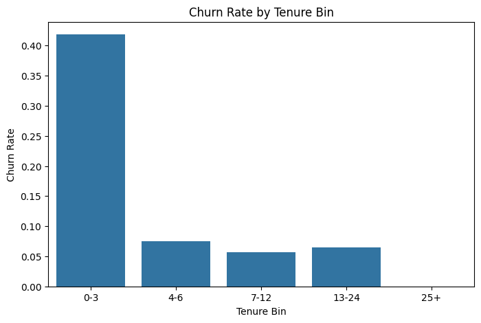
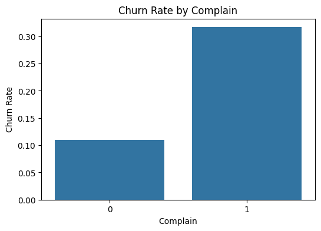
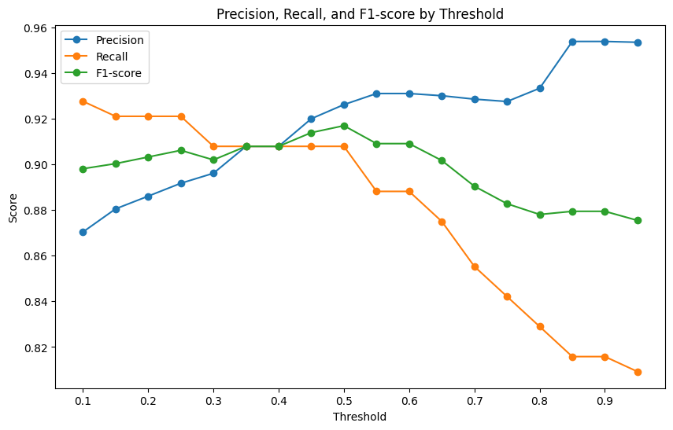
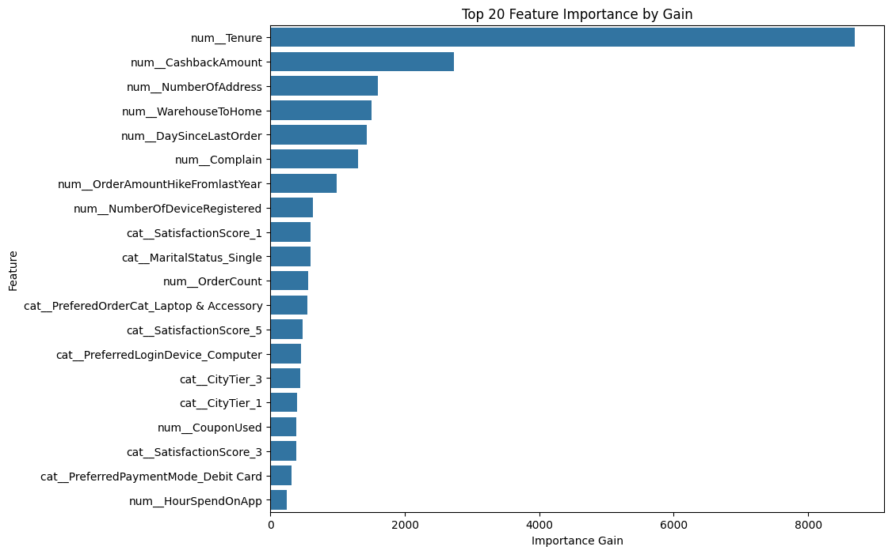
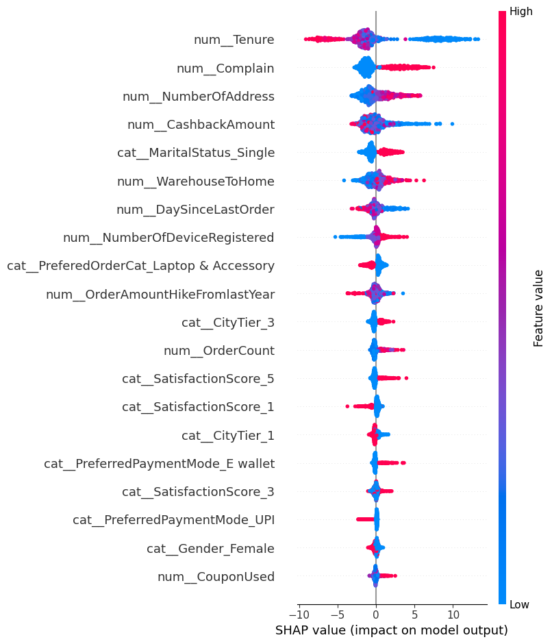

# EC顧客データを用いた離脱予測モデル構築

ECサービスの顧客データを用いて、顧客が離脱するかどうかを予測する二値分類モデルを構築しました。  
顧客属性・利用状況・購買行動に関するデータをもとに、離脱リスクの高い顧客を予測し、Feature Importance や SHAP によるモデル解釈を通じて、離脱防止施策の検討まで行いました。

---

## 目次

1. [背景・目的](#1-背景目的)
2. [使用データ](#2-使用データ)
3. [分析フロー](#3-分析フロー)
4. [EDAで確認した主な傾向](#4-edaで確認した主な傾向)
5. [前処理](#5-前処理)
6. [モデル構築と精度評価](#6-モデル構築と精度評価)
7. [ハイパーパラメータ調整](#7-ハイパーパラメータ調整)
8. [閾値調整と最終評価](#8-閾値調整と最終評価)
9. [モデル解釈](#9-モデル解釈)
10. [施策提案](#10-施策提案)
11. [本分析の限界と今後の改善](#11-本分析の限界と今後の改善)
12. [ファイル構成](#12-ファイル構成)

---

## 1. 背景・目的

ECサービスでは、新規顧客の獲得だけでなく、既存顧客の継続利用を促進することが重要です。  
特に、離脱リスクの高い顧客を事前に把握できれば、クーポン配布やフォロー施策を通じて離脱防止につなげることができます。


---

## 2. 使用データ

- データセット名：Kaggle「Ecommerce Customer Churn Analysis and Prediction」
- URL：https://www.kaggle.com/datasets/ankitverma2010/ecommerce-customer-churn-analysis-and-prediction
- データ件数：5,630件
- 目的変数：`Churn`
- 離脱率：約16.8%

本データセットでは、`Churn` は離脱フラグとして提供されていますが、離脱の具体的な定義は明記されていません。  
そのため、本分析では `Churn=1` を「離脱したと判定された顧客」、`Churn=0` を「継続顧客」として扱いました。

---

## 3. 分析フロー

本Notebookでは、以下の流れで分析を行いました。

1. データ概要の確認
2. 探索的データ分析（EDA）
3. 前処理と特徴量整理
4. Logistic Regression と LightGBM の比較
5. RandomizedSearchCV によるハイパーパラメータ調整
6. 閾値調整
7. Feature Importance / SHAP によるモデル解釈
8. 離脱防止施策の提案

---

## 4. EDAで確認した主な傾向

EDAでは、顧客属性・利用状況・購買行動と離脱率の関係を確認しました。

主な結果は以下の通りです。

- `Tenure` が短い顧客ほど離脱率が高い傾向が見られた
- `Complain=1` の顧客は、`Complain=0` の顧客より離脱率が高い傾向が見られた
- `SatisfactionScore` はスコアごとに離脱率に差が見られた
- カテゴリ変数ごとの離脱率にも差があり、顧客属性や利用状況によって離脱傾向が異なる可能性が確認された

### EDA例：Tenureと離脱率



### EDA例：Complain有無と離脱率



---

## 5. 前処理

モデル構築にあたり、以下の前処理を行いました。

- `CustomerID` は顧客識別用IDのため除外
- EDA用に作成した `Tenure_bin`、`OrderCount_bin`、`DaySinceLastOrder_bin` は除外
- 数値変数の欠損値は中央値で補完（Logistic Regressionは標準化も実施）
- カテゴリ変数は最頻値補完後に One-Hot Encoding を実施
- `SatisfactionScore` と `CityTier` は、数値型として読み込まれているものの、スコア・階層を表す変数であるためカテゴリ変数として扱った
- `Complain` は 0/1 の二値フラグであるため、数値変数として扱った

また、データは以下の3つに分割しました。

- 学習データ：64%
- 検証データ：16%
- テストデータ：20%

目的変数 `Churn` にクラス不均衡があるため、層化抽出を用いて各データの離脱率が大きく変わらないように分割しました。

---

## 6. モデル構築と精度評価

本分析では、以下のモデルを比較しました。

- Baseline
- Logistic Regression
- LightGBM

離脱率が約16.8%のクラス不均衡データであるため、Accuracy だけでなく、Precision、Recall、PR-AUCも確認しました。  
PR-AUCに相当する指標として、scikit-learn の `average_precision_score` を使用しました。

### モデル比較結果

| モデル | Accuracy | Precision | Recall | PR-AUC |
|---|---:|---:|---:|---:|
| Baseline | 0.831 | 0.000 | 0.000 | 0.169 |
| Logistic Regression | 0.816 | 0.473 | 0.809 | 0.733 |
| LightGBM | 0.950 | 0.820 | 0.901 | 0.941 |

Baseline は Accuracy が高く見える一方で、離脱顧客を一人も検出できませんでした。  
一方、LightGBM は Accuracy・Precision・Recall・PR-AUC のすべてで Logistic Regression を上回る結果となりました。

---

## 7. ハイパーパラメータ調整

LightGBM に対して、`RandomizedSearchCV` によるハイパーパラメータ調整を行いました。

- 交差検証：`StratifiedKFold`
- 評価指標：`average_precision`

### チューニング前後の比較

| モデル | Accuracy | Precision | Recall | PR-AUC |
|---|---:|---:|---:|---:|
| LightGBM | 0.950 | 0.820 | 0.901 | 0.941 |
| Tuned LightGBM | 0.972 | 0.926 | 0.908 | 0.968 |

チューニングにより、特に Precision が大きく改善しました。  
離脱顧客の見逃しを抑えつつ、施策対象の精度を高めることができました。

---

## 8. 閾値調整と最終評価

分類モデルでは、予測確率をどの閾値で 0/1 に変換するかによって、Precision、Recall、F1-score が変化します。  
本分析では、検証データを用いて閾値ごとの評価指標を確認し、F1-score が最大となる閾値 `0.50` を採用しました。

### 閾値ごとの評価指標



### テストデータでの最終評価

| 指標 | スコア |
|---|---:|
| Accuracy | 0.985 |
| Precision | 0.983 |
| Recall | 0.926 |
| F1-score | 0.954 |
| PR-AUC | 0.983 |

混同行列では、実際の離脱顧客190件のうち176件を正しく離脱と予測できており、False Negative は14件でした。

---

## 9. モデル解釈

### 9.1 Feature Importance

LightGBM の Gain ベースの Feature Importance では、以下の特徴量が重要であることを確認しました。

- `Tenure`
- `CashbackAmount`
- `NumberOfAddress`
- `WarehouseToHome`
- `DaySinceLastOrder`
- `Complain`



特に `Tenure` は最も重要度が高く、EDAで確認した「利用開始初期の顧客ほど離脱率が高い」という傾向とも整合していました。

### 9.2 SHAP

SHAPを用いて、各特徴量が離脱予測に与える影響の方向性を確認しました。

- `Tenure` が低い顧客ほど、離脱予測を高める方向に影響していた
- `Complain=1` の顧客は、離脱予測を高める方向に影響していた
- `CashbackAmount` が低い顧客ほど、離脱予測を高める傾向が見られた



---

## 10. 施策提案

モデル解釈結果を踏まえ、以下のような離脱防止施策を提案しました。

### 10.1 利用開始初期顧客へのオンボーディング強化

対象：

- `Tenure` が短く、離脱予測確率が高い顧客

施策例：

- 初回購入後のフォローメール
- 利用ガイドの提示
- 初回限定クーポン
- レコメンド商品の提示

### 10.2 クレーム発生顧客への早期フォロー

対象：

- `Complain=1` で離脱予測確率が高い顧客

施策例：

- クレーム発生後のフォロー連絡
- 補償クーポンの付与
- サポート品質の改善

### 10.3 還元・特典が少ない顧客への再購入促進

対象：

- `CashbackAmount` が低く、離脱予測確率が高い顧客

施策例：

- 期間限定クーポン
- ポイント還元キャンペーン
- パーソナライズドオファー

### 10.4 配送条件に課題がある顧客への体験改善

対象：

- `WarehouseToHome` が大きく、離脱予測確率が高い顧客

施策例：

- 配送予定日の明確化
- 配送状況通知
- 配送遅延時のフォロー

---

## 11. 本分析の限界と今後の改善

### 11.1 目的変数の定義

本データセットでは `Churn` の具体的な定義が明記されていません。  
実務では、「一定期間購入がない顧客」を離脱とみなすのか、「退会・解約した顧客」を離脱とみなすのかを明確にする必要があります。

### 11.2 特徴量の取得タイミング

Data Dict では、`Complain`、`CouponUsed`、`OrderCount`、`CashbackAmount` などが「last month」の情報として説明されています。  
一方で、その「last month」が `Churn` 判定より前の期間を指すのか、同時期または判定後を含むのかは明記されていません。

そのため、実務では各特徴量が予測時点で利用可能な情報かどうかを確認する必要があります。

### 11.3 評価方法

本データには明確な日付カラムがないため、本分析ではランダム分割で評価しました。  
実務で日付情報が利用できる場合は、過去の顧客行動データで学習し、未来の離脱を予測する形で評価することが望ましいです。

### 11.4 施策効果の検証

本分析で提案した施策は、モデル解釈結果に基づく仮説です。  
実際に施策を実行する場合は、対象者数、顧客単価、施策コスト、期待される離脱抑制効果などを確認する必要があります。

---

## 12. ファイル構成

```text
customer-churn-prediction/
├── README.md
├── 離脱予測PF.ipynb
└── images/
